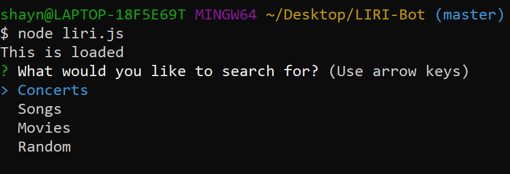
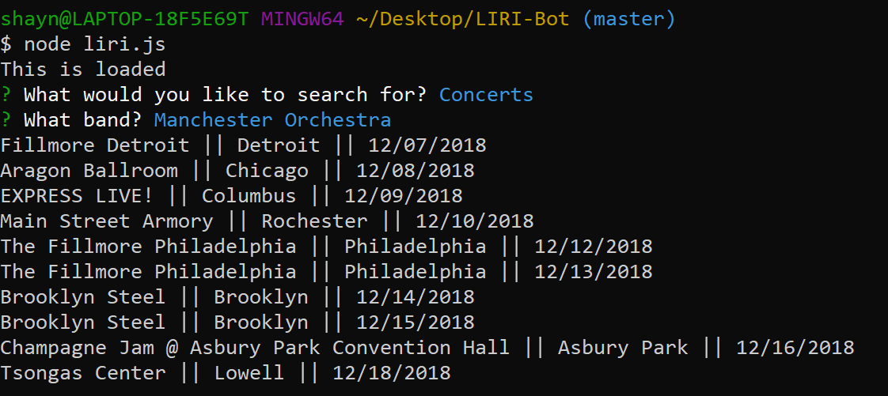
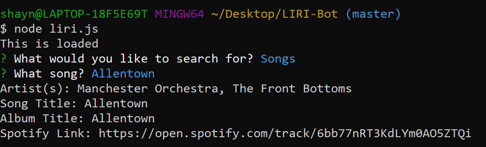
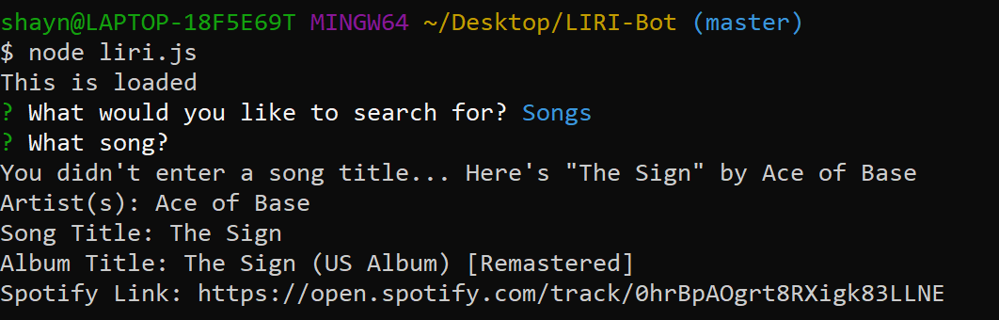
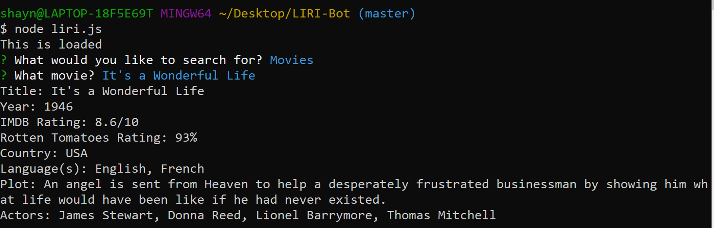
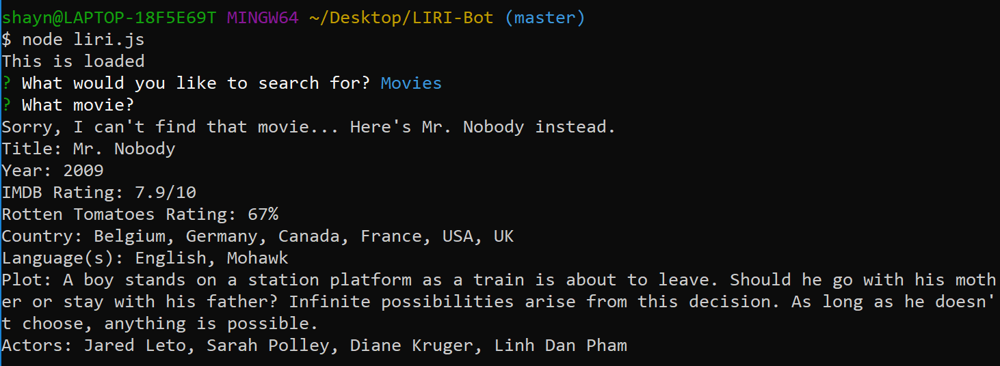
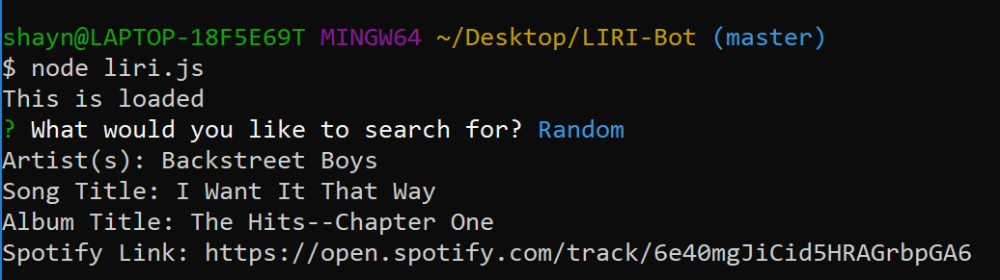
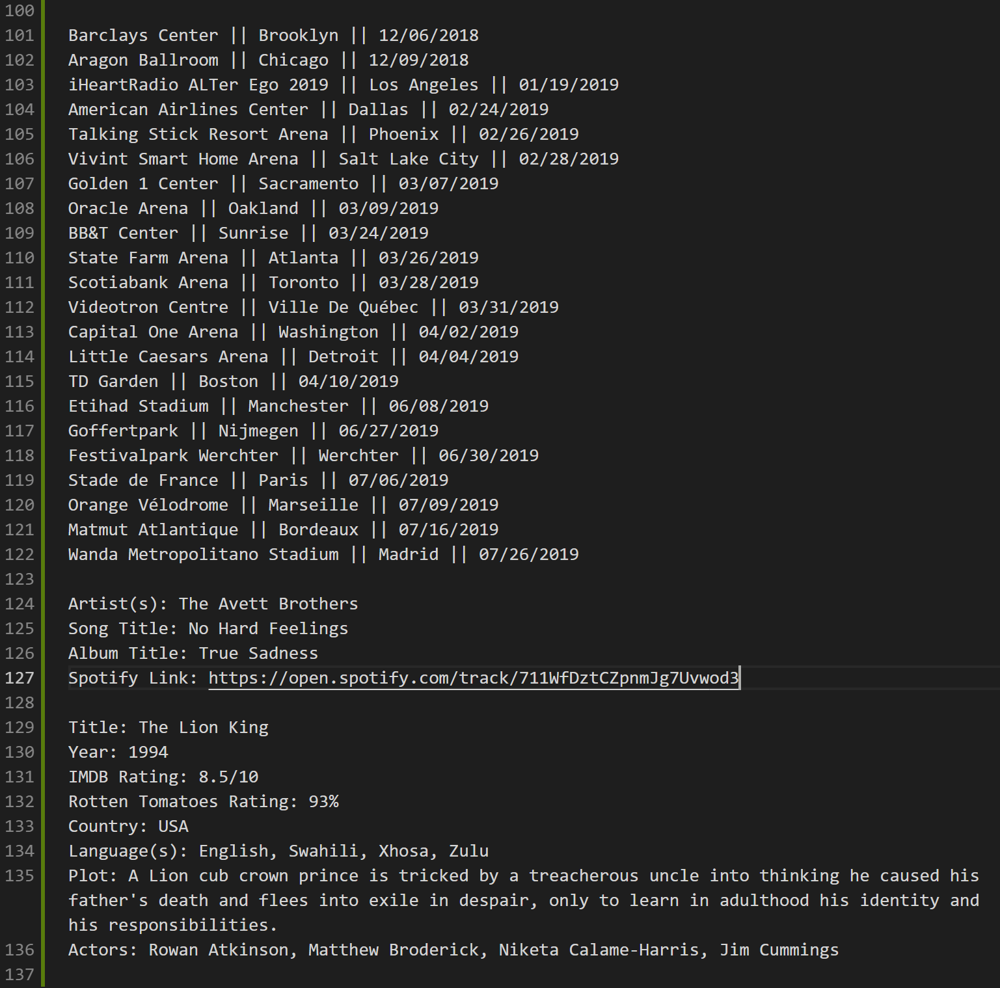

# LIRI-Bot

## About
LIRI is a Language Interpretation and Recognition Interface, a command line node app which takes input via inquirer, then returns data from various APIs (Spotify, OMDB, BandsInTown) through axios and the node-spotify-api package. In addition to logging the return data to the console, LIRI will also append it to the log.txt file in this directory for later review.

## Using LIRI
Upon running the command `node liri.js` LIRI will prompt the user to select a type of search from among the four options: Concerts, Songs, Movies, or Random.

If the user selects the concert search option, LIRI will then accept the input of a band name, then request data from the BandsInTown API based on that band name, and display a list of venues, locations, and dates of upcoming concerts for the given band.

Similarly, if the user selects the song search, LIRI will ask for the title of a song, then log info (artist name, song title, album title, and Spotify link) for the given song provided by the Spotify API (via the node-spotify-API module). If the song has multiple contributing artists, LIRI will print the names of each contributor.

However, if the user inputs an empty string for the song title, or a song title the Spotify API doesn't recognize, LIRI will default to logging the info of "The Sign" by Ace of Base.

The movie search works similarly as well. LIRI will ask for a movie title, and log a variety of data related to that movie retrieved from the OMDB API.

Again, if LIRI can't find the movie or if the user provides no title, the information for the movie Mr. Nobody will be logged instead.

Lastly, if the user selects a random search, LIRI reads the random.txt file in this directory and queries the Spotify API with the retrieved data. For now, random.txt only contains the song title "I Want it That Way", but if I have time I may add more options from which LIRI can randomly choose, and use them for queries to the other APIs LIRI can access.

## Logging

As mentioned above, in addition to logging data to the terminal, LIRI also appends it to the log.txt file, so the user can review previous searches.

## Thanks

Thanks for trying out LIRI :-)